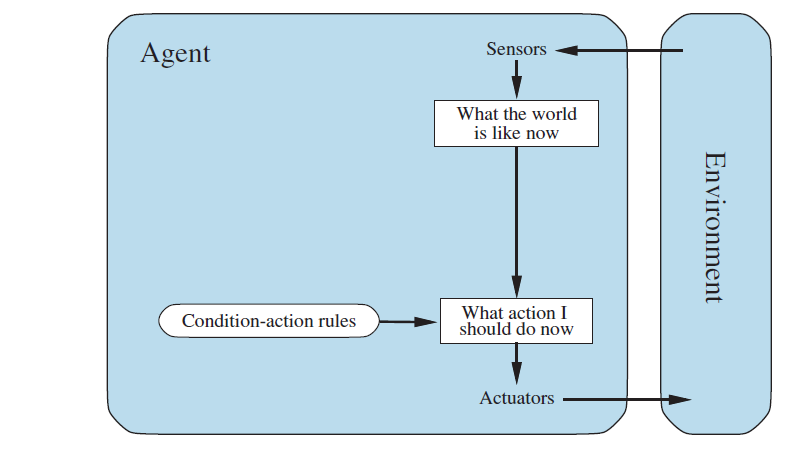
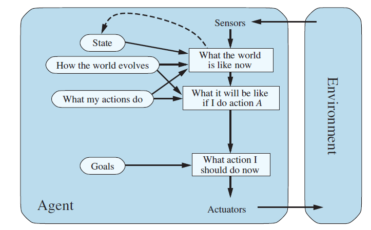
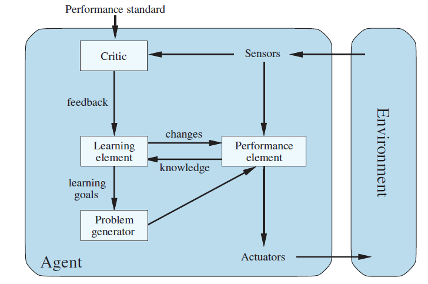

Perfect 👌 You made it very clear already. Now I’ll keep your structure (**Definition → Explanation → Example**) and after each type, I’ll add the **Bangla translation** so you can revise both languages easily.

---

## **Types of Agents (AI)**

---

### 1. **Simple Reflex Agent**

* **Definition:** An agent that acts only on the basis of the **current percept**.
* **Explanation:** It ignores history and just reacts to what it sees right now. Works well in fully observable environments but fails in partially observable ones.
* **Example:** A vacuum cleaner that sucks dirt if it sees dirt, otherwise moves left or right.

**বাংলায়:**

* **সংজ্ঞা:** এমন এজেন্ট, যা শুধু **বর্তমান ইনপুট (percept)** দেখে কাজ করে।
* **ব্যাখ্যা:** ইতিহাস উপেক্ষা করে কেবল বর্তমান অবস্থার উপর নির্ভর করে সিদ্ধান্ত নেয়। পুরোপুরি দৃশ্যমান পরিবেশে কাজ করে, কিন্তু আংশিকভাবে দৃশ্যমান হলে ব্যর্থ হয়।
* **উদাহরণ:** ভ্যাকুয়াম ক্লিনার – ময়লা দেখলেই Suck করবে, নইলে বামে বা ডানে যাবে।

---

### 2. **Model-Based Reflex Agent**

* **Definition:** An agent that keeps track of the **world’s state** using percept history.
* **Explanation:** It uses an **internal model** (transition model + sensor model) to understand how the world changes and what it cannot directly see.
* **Example:** A robot that remembers where obstacles were in the past even if they are not currently visible.

**বাংলায়:**

* **সংজ্ঞা:** এমন এজেন্ট, যা percept history ব্যবহার করে বিশ্বের **অবস্থা মনে রাখে**।
* **ব্যাখ্যা:** এটি একটি **internal model** ব্যবহার করে, যাতে বোঝে কিভাবে পরিবেশ বদলায় এবং কী কী জিনিস সরাসরি দেখা যাচ্ছে না।
* **উদাহরণ:** রোবট – আগের কোনো বাধা কোথায় ছিল সেটা মনে রাখে, যদিও এখন দেখা যাচ্ছে না।

---

### 3. **Goal-Based Agent**

* **Definition:** An agent that acts to **achieve specific goals**.
* **Explanation:** It doesn’t just react to states but also evaluates whether an action will lead it closer to the goal. More flexible since changing the goal changes its behavior.
* **Example:** A GPS navigation system that chooses actions (turn left, turn right) to reach the destination.

**বাংলায়:**

* **সংজ্ঞা:** এমন এজেন্ট, যা নির্দিষ্ট **লক্ষ্য (goal)** অর্জনের জন্য কাজ করে।
* **ব্যাখ্যা:** এটি শুধু অবস্থায় প্রতিক্রিয়া জানায় না, বরং দেখে কোন কাজ তাকে লক্ষ্যের কাছে নিয়ে যাবে। লক্ষ্য পরিবর্তন হলে আচরণও পরিবর্তিত হয়।
* **উদাহরণ:** GPS সিস্টেম – গন্তব্যে পৌঁছাতে বামে বা ডানে মোড় নেওয়ার সিদ্ধান্ত নেয়।

---

### 4. **Utility-Based Agent**

* **Definition:** An agent that makes decisions based on a **utility function** (how good or bad an outcome is).
* **Explanation:** Even if there are multiple ways to achieve a goal, it picks the one with the **highest utility** (best trade-off). Works well in uncertain environments.
* **Example:** A taxi that chooses the fastest, safest, or cheapest route depending on passenger preference.

**বাংলায়:**

* **সংজ্ঞা:** এমন এজেন্ট, যা একটি **utility function** এর ভিত্তিতে সিদ্ধান্ত নেয় (কোন ফল ভালো বা খারাপ তা নির্ধারণ করে)।
* **ব্যাখ্যা:** যদি একই লক্ষ্য অর্জনের অনেক পথ থাকে, তবে এটি সর্বোচ্চ সুবিধাজনক পথ বেছে নেয়। অনিশ্চিত পরিবেশে ভালো কাজ করে।
* **উদাহরণ:** ট্যাক্সি – যাত্রীর পছন্দ অনুযায়ী দ্রুততম, নিরাপদ, বা সস্তা পথ বেছে নেয়।

---

### 5. **Learning Agent**

* **Definition:** An agent that can **improve its performance** by learning from experience.
* **Explanation:** It has 4 components:

  1. **Performance Element** → selects actions.
  2. **Learning Element** → improves from past experiences.
  3. **Critic** → gives feedback on performance.
  4. **Problem Generator** → suggests new exploratory actions.
* **Example:** A chess-playing AI that gets better by analyzing its past games.

**বাংলায়:**

* **সংজ্ঞা:** এমন এজেন্ট, যা **অভিজ্ঞতা থেকে শিখে** নিজের কর্মক্ষমতা উন্নত করে।
* **ব্যাখ্যা:** এতে ৪টি অংশ থাকে –

  1. **Performance Element** → কাজ নির্বাচন করে।
  2. **Learning Element** → অভিজ্ঞতা থেকে শেখে।
  3. **Critic** → কাজের ভালো-মন্দ বিচার করে।
  4. **Problem Generator** → নতুন কিছু চেষ্টা করার পরামর্শ দেয়।
* **উদাহরণ:** দাবা খেলা AI – নিজের আগের গেম বিশ্লেষণ করে ধীরে ধীরে ভালো খেলে।

---

👉 In short (সংক্ষেপে):

* **Simple Reflex** → reacts only to current input (শুধু বর্তমান ইনপুট দেখে কাজ করে)।
* **Model-Based Reflex** → remembers past & hidden state (অতীত ও লুকানো অবস্থা মনে রাখে)।
* **Goal-Based** → chooses actions to achieve goals (লক্ষ্যে পৌঁছাতে কাজ বেছে নেয়)।
* **Utility-Based** → chooses the best (optimal) action (সবচেয়ে ভালো পদক্ষেপ বেছে নেয়)।
* **Learning** → learns and improves over time (সময় ধরে শেখে ও উন্নতি করে)।

---

চাইলে আমি এখন এগুলোকে একটা **comparison table (side-by-side)** বানিয়ে দেবো, যাতে এক নজরে সব পার্থক্য বোঝা যায়। তুমি কি সেটা চাও?