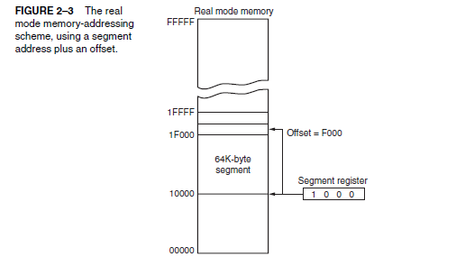
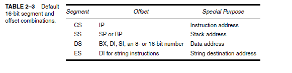
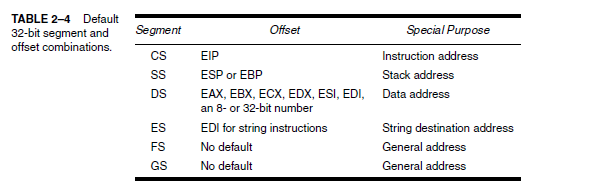
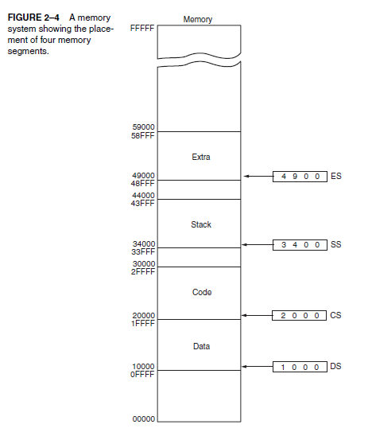

একদম ঠিক 👌 তুমি এখন পর্যন্ত যেটুকু শিখেছো, সেটা আমি সুন্দরভাবে **সংক্ষিপ্ত নোট আকারে** সাজিয়ে দিচ্ছি। তুমি চাইলে সরাসরি কপি করে তোমার নোটে রেখে দিতে পারবে।

---

# 📒 Real Mode Memory Addressing – Notes

### 🔹 What is Real Mode?

* Real Mode হলো Intel 8086/8088 এবং 80286 (real mode) এর একটি memory addressing system।
* এখানে প্রসেসর **সর্বোচ্চ 1 MB RAM** (1,048,576 bytes) অ্যাক্সেস করতে পারে।
* Windows real mode ব্যবহার করে না, কিন্তু DOS real mode ব্যবহার করে।

---

### 🔹 How Memory Address is Calculated?

* Memory address তৈরি হয়:

  
  Physical Address = (Segment × 16) + Offset
  
* Segment Register = 16 bit (যেমন CS, DS, SS, ES)
* Offset = 16 bit
* মিলে = 20-bit Physical Address (max 1MB)

---

### 🔹 Why 1 MB Limit?

* 8086-এর **20-bit address bus** আছে।
* 2^20 = 1,048,576 bytes = **1 MB memory limit**।
* তাই, শুরু থেকেই 8086 প্রসেসর কেবল 1MB পর্যন্ত দেখতে পারে।

---

### 🔹 Real Life Example:

* লাইব্রেরি → মেমরি (1MB)
* Shelf (Segment Register) → আলাদা অংশ
* Book position (Offset) → শেলফের ভেতরে বইয়ের স্থান
  👉 Shelf + Book position মিলে আসল বইয়ের অবস্থান পাওয়া যায়।

---

### 🔹 `Important Points:`

1. প্রথম 1 MB মেমরিকে বলা হয়: **Real Memory / Conventional Memory / DOS Memory**।
2. Real mode **8086/8088** এবং 80286 এ ব্যবহৃত, এবং আধুনিক প্রসেসর boot-এর শুরুতে অল্প সময়ের জন্য real mode-এ থাকে।
3. Protected Mode বা 64-bit Long Mode এ গেলে পুরো RAM (যেমন 4GB, 8GB, 16GB …) অ্যাক্সেস করা যায়।

---

✅ এই নোট রাখলে তোমার **real mode memory addressing** বিষয়ে সব প্রয়োজনীয় পয়েন্ট হাতে থাকবে।

---

চাও কি আমি এর সাথে একটা **numerical example (Segment + Offset → Physical Address)** ও নোটে যোগ করে দিই?

ঠিক আছে 👍 আমি পুরো বিষয়টা সুন্দরভাবে **নোট আকারে সাজিয়ে দিলাম**, যেন তুমি একসাথে পড়ে রাখতে পারো।

---

# 📘 Real Mode Memory Addressing (Segments and Offsets) – Note

## 1. Segment and Offset Concept

* Real mode-এ কোনো মেমরি লোকেশন অ্যাক্সেস করতে হয়:
  **Physical Address = (Segment Register × 10H) + Offset**

* **Segment Address** → 16-bit সেগমেন্ট রেজিস্টার (CS, DS, SS, ES ইত্যাদি)।

* **Offset Address** → সেগমেন্টের ভেতরের অবস্থান (16-bit, যেমন IP, SP, BP ইত্যাদি থেকে আসতে পারে)।

---

## 2. Segment Address

* সেগমেন্ট রেজিস্টারের ভেতরের মান আসলে **শুরুর অ্যাড্রেস**কে বোঝায় না সরাসরি।
* বাস্তবে সেগমেন্ট রেজিস্টারের মানের **ডানদিকে একটি 0 (hex)** বসানো হয়।

  * মানে, Segment × 10H করা হয়।
  * এভাবে 16-bit → 20-bit অ্যাড্রেস তৈরি হয়।

### উদাহরণ:

* Segment = `1000H` → Start = `10000H`
* Segment = `1200H` → Start = `12000H`
* Segment = `1201H` → Start = `12010H`

---

## 3. Paragraph Concept

* যেহেতু Segment × 10H করা হয়, তাই সব সেগমেন্ট শুরু হয় **16-byte boundary** থেকে।
* এই 16-byte boundary-কে বলা হয় **Paragraph**।

---

## 4. Segment Size

* প্রতিটি সেগমেন্টের দৈর্ঘ্য স্থিরভাবে **64 KB (FFFFH + 1)**।
* সুতরাং যদি সেগমেন্ট শুরুর অ্যাড্রেস = `X`,
  তাহলে শেষ অ্যাড্রেস = `X + FFFFH`।

### উদাহরণ:

* Segment Register = `3000H`

  * Start = `30000H`
  * End = `3FFFFH`

---

## 5. Offset Address

* Offset হলো সেগমেন্ট শুরুর ঠিকানার **উপর কতটা দূরত্ব**।
* Final Physical Address বের হয়:

  
  Physical Address = (Segment × 10H) + Offset
  

### উদাহরণ:

* Segment = `1000H`, Offset = `F000H`

  
  Physical Address = 1000H × 10H + F000H
                   = 10000H + F000H
                   = 1F000H
  

---

## 6. Address Range in Real Mode

* 20-bit address bus → সর্বোচ্চ অ্যাড্রেস = `FFFFFH` (1 MB – 1)।
* তাই রিয়েল মোডে মোট addressable memory = **1 MB**।

---

## 7. Overlapping Segments

* Segment × 10H এর কারণে সেগমেন্টগুলো overlap করতে পারে।
* যেমন:

  * Segment = 1000H → Start = 10000H
  * Segment = 1001H → Start = 10010H
    (দুটো সেগমেন্ট একে অপরের সাথে আংশিক overlap করবে।)

---

## ✨ Final Summary

* **Physical Address = Segment × 10H + Offset**
* Segment → সর্বদা 16-byte boundary (Paragraph) থেকে শুরু হয়।
* Segment length সর্বদা 64 KB।
* Real Mode-এ সর্বোচ্চ memory = 1 MB (20-bit addressing)।
* Segments overlap করতে পারে।

---

👉 এখন বলো, আমি কি এই নোটের সাথে **একটা ছোট টেবিল** বানিয়ে দিই (Segment Register → Start Address → End Address → Example Offset → Final Address) যাতে তুমি প্র্যাকটিস করতে পারো?

### রিয়েল মোড মেমরি অ্যাড্রেসিং

**রিয়েল মোড** হলো একটি অ্যাড্রেসিং মোড, যেখানে সেগমেন্ট এবং অফসেট ব্যবহার করে ফিজিক্যাল মেমরি অ্যাড্রেস বের করা হয়। এর মূল ফর্মুলা:

### 1) **মেমরি অ্যাড্রেস বের করার ফর্মুলা**

ফিজিক্যাল অ্যাড্রেস = (সেগমেন্ট × 16) + অফসেট

এখানে:

* **সেগমেন্ট** হলো বেস অ্যাড্রেস (Starting Point)।
* **অফসেট** হলো সেগমেন্ট থেকে কতটা দূরে মেমরি অবস্থান করছে।

---

### 2) **উদাহরণ:**

**অফসেটের সাথে সেগমেন্ট যোগ করে ফিজিক্যাল অ্যাড্রেস কিভাবে বের হয়**

#### উদাহরণ ১:

সেগমেন্ট = 1000h
অফসেট = 2000h
ফিজিক্যাল অ্যাড্রেস:

* `(1000h × 16) = 10000h`
* `10000h + 2000h = 12000h`

#### উদাহরণ ২:

সেগমেন্ট = 2000h
অফসেট = 0000h
ফিজিক্যাল অ্যাড্রেস:

* `(2000h × 16) = 20000h`
* `20000h + 0000h = 20000h`
  শেষ অ্যাড্রেস: `20000h` থেকে `2FFFFh`

#### উদাহরণ ৩:

সেগমেন্ট = 1234h
অফসেট = FFFFh
ফিজিক্যাল অ্যাড্রেস:

* `(1234h × 16) = 12340h`
* `12340h + FFFFh = 2233Fh`

---

### 3) **A20 লাইন:**

**A20 লাইন** হলো একটি কন্ট্রোল সিগন্যাল যা **1MB এর উপরে মেমরি অ্যাক্সেস** করতে সাহায্য করে।

#### A20 চালু থাকলে:

* **A20 চালু** থাকলে **1MB এর পরে** মেমরি অ্যাক্সেস করা যায়, অর্থাৎ, \*\*এটি **High Memory Area (HMA)** হিসেবে ব্যবহৃত হয়।
* এই অবস্থায় সেগমেন্ট `0xFFFF` এবং অফসেট `0x4000` হলে:

  * `(FFFFh × 16) + 4000h = 103FF0h`

#### A20 বন্ধ থাকলে:

* **A20 বন্ধ** থাকলে মেমরি অ্যাক্সেস **1MB এর পরে র‍্যাপ-around** হয়ে আবার শুরু হয়।
* যখন **A20 বন্ধ থাকে**, সেগমেন্ট এবং অফসেট যোগ করলে **পুরো মেমরি 1MB এর ভেতরে** থাকবে।

---

### 4) **অ্যাক্সেসযোগ্য মেমরি সীমা**

* রিয়েল মোডে **1MB পর্যন্ত অ্যাক্সেস করা** যায়।
* তবে **A20 লাইন চালু** থাকলে 1MB এর পর **High Memory Area** অ্যাক্সেস করা সম্ভব হয়।

---

### 5) **মনে রাখার জন্য শর্টকাট:**

* **ফর্মুলা**:
  **Phys = Segment × 16 + Offset**

* **প্রতিটি সেগমেন্টের সাইজ**: **64KB** (0000h থেকে FFFFh)

* **A20 চালু থাকলে**: **1MB এর পরের মেমরি** অ্যাক্সেস করা সম্ভব।

* **A20 বন্ধ থাকলে**: **1MB এর পরে র‍্যাপ-অ্যারাউন্ড** হবে এবং আবার 0 থেকে শুরু হবে।

---

এখন, যদি এই সব বিষয়গুলো মনে রাখো, তাহলে তুমি খুব সহজেই মাইক্রোপ্রসেসরের **রিয়েল মোড মেমরি অ্যাড্রেসিং** বুঝতে পারবে! 😊

ঠিক আছে 👍 আমি তোমার দেওয়া লেখাটা সহজভাবে ভেঙে ব্যাখ্যা করে দিচ্ছি।

---
# Default segment and offset registers 
---

## 🔹 1) মাইক্রোপ্রসেসরের রুলস (Segment Registers এর ব্যবহার)

### 1. Code Segment (CS) এবং Instruction Pointer (IP)

* **CS (Code Segment Register):** মেমরির সেই অংশ নির্দেশ করে যেখানে প্রোগ্রামের কোড (instructions) রাখা আছে।
* **IP (Instruction Pointer):** CS সেগমেন্টের ভেতরে কোন জায়গায় পরবর্তী ইন্সট্রাকশন আছে সেটা নির্দেশ করে।

👉 তাই **CS\:IP = Next Instruction এর ঠিকানা**
মানে, প্রসেসর সবসময় CS (কোথা থেকে শুরু হবে) আর IP (কতদূরে যাবে) মিলিয়ে কোড বের করে আনে।

**উদাহরণ:**

CS = 2000H
IP = 0030H
Physical Address = (2000H × 10H) + 0030H
                 = 20000H + 0030H
                 = 20030H

এখান থেকে CPU পরবর্তী ইন্সট্রাকশন নেবে।

---

### 2. Stack Segment (SS) এবং Stack Pointer (SP/ESP/EBP)

* **SS (Stack Segment Register):** মেমরির সেই অংশ নির্দেশ করে যেখানে স্ট্যাক (Stack) রাখা আছে।
* **SP (Stack Pointer, 16-bit) / ESP (32-bit) / EBP (Base Pointer):** SS সেগমেন্টের ভেতরে স্ট্যাকের নির্দিষ্ট লোকেশন দেখায়।

👉 তাই **SS\:SP / SS\:ESP / SS\:EBP = Stack Addressing Scheme**
মানে, স্ট্যাকের ভেতরে কোন ডাটা রাখা/তোলা হবে সেটা এই জোড়ার (pair) মাধ্যমে নির্ধারণ হয়।

**উদাহরণ:**

SS = 3000H
SP = 00F0H
Physical Address = (3000H × 10H) + 00F0H
                 = 30000H + 00F0H
                 = 300F0H

অর্থাৎ স্ট্যাকের ডাটা 300F0H লোকেশনে আছে।

---

## ✨ সহজ করে বললে:

1. **CS\:IP → প্রোগ্রাম কোড কোথায় আছে সেটা CPU জানার জন্য।**

   * CS = সেগমেন্ট শুরু
   * IP = অফসেট (ভেতরের অবস্থান)

2. **SS\:SP (বা SS\:ESP, SS\:EBP) → স্ট্যাক মেমরিতে কোথায় ডাটা রাখা/তোলা হবে সেটা দেখায়।**

---

👉 তুমি কি চাও আমি এগুলো **একটা ছোট টেবিলে CS\:IP আর SS\:SP এর উদাহরণ সহ** সাজিয়ে দিই, যেন পড়ার সময় এক নজরে বোঝা যায়?

এই পৃষ্ঠায় মাইক্রোপ্রসেসর মেমরি অ্যাড্রেসিংয়ের **সেগমেন্ট** এবং **অফসেট** রেজিস্টারের কাজ নিয়ে আলোচনা করা হয়েছে। এখানে মাইক্রোপ্রসেসরের **রুলস** এবং **ডিফল্ট সেগমেন্ট ও অফসেট রেজিস্টার** নিয়ে কিছু গুরুত্বপূর্ণ তথ্য দেওয়া হয়েছে:

### 1) **মাইক্রোপ্রসেসরের রুলস**

* **সেগমেন্ট রেজিস্টার** সাধারণত **CS (Code Segment)** বা **SS (Stack Segment)** হিসেবে থাকে, যেখানে **CS\:IP** (ইন্সট্রাকশন পয়েন্টার) পরবর্তী ইনস্ট্রাকশন নির্দেশ করে।
* সেগমেন্টের শুরু অবস্থানকে নির্দেশ করার জন্য **CS\:IP** ব্যবহৃত হয়।
* স্ট্যাক (Stack) সেগমেন্টের জন্য **SS** এবং **EBP** বা **ESP** ব্যবহৃত হয়, যেখানে **SS\:ESP** বা **SS\:EBP** এই অ্যাড্রেসিং স্কিম ব্যবহৃত হয়।

### 2) **স্ট্যাক সেগমেন্ট**

* উদাহরণস্বরূপ, যদি SS = 2000H এবং SP = 3000H, তাহলে এটি **23000H** ঠিকানার দিকে নির্দেশ করবে।
* স্ট্যাকের সেগমেন্টে, যেহেতু শুধুমাত্র 16-বিটে সীমাবদ্ধ, তাই 80386 এবং Pentium 4 প্রক্রিয়াতে Extended Addressing ব্যবহার হয়।

### 3) **অফসেট রেজিস্টারের সাথে মেমরি অ্যাড্রেসিং**

* উদাহরণ হিসেবে, যদি **SS = 2000H** এবং **SP = 3000H**, তাহলে সিস্টেম **23000H** অ্যাড্রেসে পৌঁছাবে।
* 80386 থেকে Pentium 4 পর্যন্ত, Extended Addressing ব্যবস্থা ব্যবহার হয়, যেখানে সিস্টেম **16-বিট সীমাবদ্ধতা** সরিয়ে দেয়।

### 4) **মেমরি অ্যাড্রেসিং টেবিল (টেবিল ২-৩)**

* 80386 এবং 80286 প্রক্রিয়াগুলির জন্য সেগমেন্ট এবং অফসেট অ্যাড্রেসিং রুলসের বর্ণনা দেওয়া হয়েছে।
* 80386 এবং Pentium প্রক্রিয়ায় আরও সেগমেন্ট এবং অফসেট ব্যবহৃত হতে পারে যা 8086 এবং 80286 থেকে আলাদা।

### 5) **অ্যাপ্লিকেশন লোডিং**

* অ্যাপ্লিকেশন যখন লোড হয়, তখন **1000H** সেগমেন্টের জন্য অ্যাড্রেসিং এবং কোড লোড করা হয়। সিস্টেম **190H বাইট** ব্যবহৃত করে।

এই পৃষ্ঠায় ডিফল্ট সেগমেন্ট এবং অফসেট রেজিস্টারগুলির মূল কাজ এবং তাদের ব্যবহারের উদাহরণ দেওয়া হয়েছে, যাতে মেমরি অ্যাড্রেসিং সহজভাবে বোঝা যায়।

